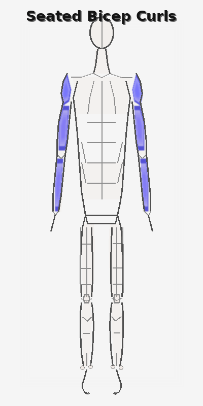
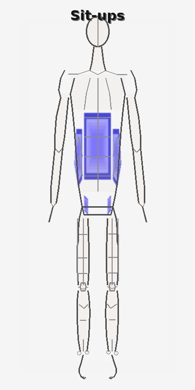

# Workout Generator

A Python package for generating workout visualization images with wireframe human figures and muscle activation highlighting.

## Example Animations

### Seated Bicep Curls


### Sit-ups


These animations show the gradual activation of muscles during exercise, transitioning from blue (inactive) to red (fully activated).

## Features

- **Wireframe Human Figure**: Safe-for-work, simplified wireframe representation of the human body
- **Muscle Activation Visualization**: Color-coded muscle highlighting (blue = inactive, red = fully activated)
- **Multiple Muscle Groups**: Support for major muscle groups including:
  - Upper body: chest, shoulders, biceps, triceps, forearms, upper back, lats, abs, obliques
  - Lower body: quads, hamstrings, glutes, calves, hip flexors
- **Animation Support**: Generate multiple frames showing gradual muscle activation
- **Easy to Use**: Simple API for generating workout images

## Installation

```bash
pip install -e .
```

For development:
```bash
pip install -e ".[dev]"
```

## Quick Start

```python
from workout_generator import generate_workout_image, MuscleGroup

# Generate a bicep curls visualization
image = generate_workout_image(
    "Bicep Curls",
    {
        MuscleGroup.BICEPS: 90,      # 90% activation
        MuscleGroup.FOREARMS: 60,    # 60% activation
    },
    save_path="bicep_curls.png"
)
```

## Usage Examples

### Basic Usage

```python
from workout_generator import generate_workout_image, MuscleGroup

# Squats
generate_workout_image(
    "Squats",
    {
        MuscleGroup.QUADS: 95,
        MuscleGroup.GLUTES: 90,
        MuscleGroup.HAMSTRINGS: 70,
        MuscleGroup.CALVES: 40,
        MuscleGroup.ABS: 50,
    },
    save_path="squats.png"
)

# Push-ups
generate_workout_image(
    "Push-ups",
    {
        MuscleGroup.CHEST: 85,
        MuscleGroup.TRICEPS: 75,
        MuscleGroup.SHOULDERS: 65,
        MuscleGroup.ABS: 55,
    },
    save_path="pushups.png"
)
```

### Advanced Usage with Generator Class

```python
from workout_generator import WorkoutImageGenerator, MuscleGroup

# Create a generator instance
generator = WorkoutImageGenerator(width=500, height=1000)

# Generate animation frames
frames = generator.generate_animation_frames(
    {
        MuscleGroup.SHOULDERS: 95,
        MuscleGroup.TRICEPS: 70,
        MuscleGroup.ABS: 45,
    },
    num_frames=10,
    title="Shoulder Press"
)

# Save frames
for i, frame in enumerate(frames):
    frame.save(f"frame_{i}.png")
```

### Creating Animated GIFs

```python
from workout_generator import WorkoutImageGenerator, MuscleGroup

generator = WorkoutImageGenerator()

# Generate frames for seated bicep curls
bicep_frames = generator.generate_animation_frames(
    {
        MuscleGroup.BICEPS: 95,
        MuscleGroup.FOREARMS: 70,
        MuscleGroup.SHOULDERS: 30,
    },
    num_frames=20,
    title="Seated Bicep Curls"
)

# Save as animated GIF
bicep_frames[0].save(
    "seated_bicep_curls.gif",
    save_all=True,
    append_images=bicep_frames[1:],
    duration=200,  # 200ms per frame
    loop=0  # Loop forever
)
```

### Available Muscle Groups

- `MuscleGroup.CHEST` - Pectoral muscles
- `MuscleGroup.SHOULDERS` - Deltoids
- `MuscleGroup.BICEPS` - Biceps brachii
- `MuscleGroup.TRICEPS` - Triceps brachii
- `MuscleGroup.FOREARMS` - Forearm muscles
- `MuscleGroup.UPPER_BACK` - Upper back muscles
- `MuscleGroup.LATS` - Latissimus dorsi
- `MuscleGroup.ABS` - Rectus abdominis
- `MuscleGroup.OBLIQUES` - Oblique muscles
- `MuscleGroup.QUADS` - Quadriceps
- `MuscleGroup.HAMSTRINGS` - Hamstring muscles
- `MuscleGroup.GLUTES` - Gluteal muscles
- `MuscleGroup.CALVES` - Calf muscles
- `MuscleGroup.HIP_FLEXORS` - Hip flexor muscles

### Activation Levels

Activation levels range from 0 (inactive) to 100 (maximum activation):

- `0` - No activation (blue)
- `25` - Low activation (blue-purple)
- `50` - Medium activation (purple)
- `75` - High activation (orange-red)
- `100` - Maximum activation (bright red)

## Running Examples

The package includes example scripts that demonstrate various exercises:

### Generate Static Images
```bash
cd examples
python generate_examples.py
```

This will generate example images in `examples/output/` for:
- Bicep Curls
- Squats
- Push-ups
- Plank
- Deadlift
- Shoulder Press (animation frames)

### Generate Animated GIFs
```bash
cd examples
python generate_animations.py
```

This will generate animated GIFs in `examples/output/` for:
- Seated Bicep Curls (animated GIF showing muscle activation)
- Sit-ups (animated GIF showing muscle activation)

## API Reference

### `generate_workout_image()`

Convenience function to generate a single workout image.

**Parameters:**
- `exercise_name` (str): Name of the exercise
- `muscle_activations` (Dict[MuscleGroup, float]): Dictionary mapping muscle groups to activation levels (0-100)
- `width` (int): Image width in pixels (default: 400)
- `height` (int): Image height in pixels (default: 800)
- `save_path` (Optional[str]): Path to save the image

**Returns:** PIL Image object

### `WorkoutImageGenerator`

Main class for generating workout images.

**Methods:**

- `__init__(width=400, height=800, background_color=(255, 255, 255))`: Initialize the generator
- `generate(muscle_activations, title=None)`: Generate a single image
- `generate_animation_frames(muscle_activations, num_frames=10, title=None)`: Generate animation frames

## Safety and Censorship

This package is designed to be safe for work and appropriate for all ages:

- The wireframe figure is a simplified stick figure representation
- All potentially sensitive areas are appropriately censored or simplified
- The focus is on muscle groups, not anatomical details

## License

MIT License

## Contributing

Contributions are welcome! Please feel free to submit a Pull Request.
